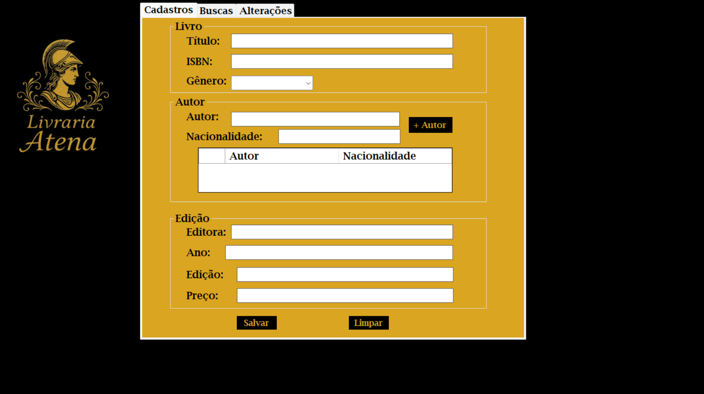
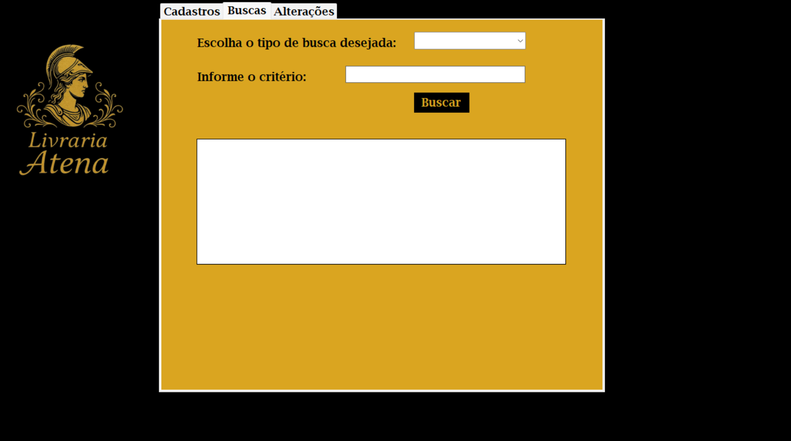
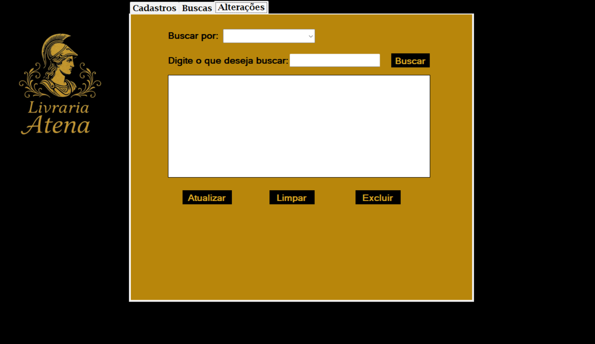

# livraria-atena
Projeto desenvolvido junto à disciplina de Linguagem e Técnicas de Programação I, 2025, pelos alunos Juliano de Melo Gregório e Viviane Tamíris Pereira, sob a orientação do professor dr. Matheus Eloy Franco.

**Linguagens Utilizadas:**
C#
SQL

**Ferramentas Utilizadas:**
Microsoft Visual Studio
MySql Workbench
HeidiSQL
Xampp

**Funções do Software:**
Login de acesso;
Inserir livros, autores e edições;
Cadastrar dados (por títulos, autores, gêneros e editoras);
Alterar dados;
Remover dados;

**Tela de login:**

**Tela de Casdastros**

**Tela de Buscas**

**Tela de Alterações**

